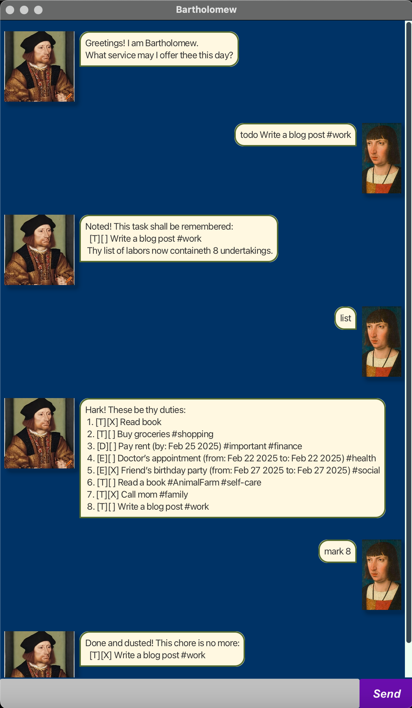

# Bartholomew User Guide

Greetings, good traveler! I am Bartholomew, thy most faithful scribe. Entrust thy tasks to me, and I shall remember them for thy.

## Notes about the command format:

- Items in square brackets are optional.
  e.g., `todo <taskDescription> [#<tagString>]` can be used as `todo Read a book #reading` or `todo Read a book`.

- Items with `...` after them can be used multiple times, including zero times.
  e.g., `[#<tagString>]...` can be used as (i.e., 0 times), `#reading`, `#reading #study`, etc.

- Parameters can only be in specified order.
  e.g., `todo #<tagString> <taskDescription>` is an invalid format, correct format should be `todo <taskDescription> #<tagString>`

- When entering single-parameter commands such as `list` and `bye`, avoid adding trailing spaces after the command. Trailing spaces can cause the command to fail and result in an error message,

- Tags do not support spaces. When adding tags to tasks, ensure that the tag is a single word without any spaces. For example, use `#importanttask` instead of `#important task`.

**Be sure to double-check the format of your commands!**

## Listing all tasks: `list`
Displays a list of all the tasks you have entered.

**Format:** `list`

## Adding a task: `todo`, `deadline`, `event`

### Adding a to-do task: `todo`
Adds a to-do task to your list.

**Format:** `todo <taskDescription> [#<tagString>]`

**Examples:**
- `todo Read a book #reading`
- `todo Complete homework #study #urgent`

### Adding a deadline task: `deadline`
Adds a deadline task with a due date.

**Format:** `deadline <taskDescription> /by <yyyy-MM-dd> [#<tagString>]`

**Examples:**
- `deadline Submit report /by 2025-02-20 #work`
- `deadline Complete assignment /by 2025-03-01 #university`

### Adding an event task: `event`
Adds an event task with a start and end date.

**Format:** `event <taskDescription> /from <yyyy-MM-dd> /to <yyyy-MM-dd> [#<tagString>]`

**Examples:**
- `event Birthday party /from 2025-03-15 /to 2025-03-16 #celebration`
- `event Team meeting /from 2025-03-10 /to 2025-03-10 #work #important`

## Modifying tasks: `mark`, `unmark`, `tag`, `untag`, `delete`

### Marking a task as done: `mark`
Marks a task as completed.

**Format:** `mark <taskNumber>`

**Example:**
- `mark 1`

### Unmarking a task: `unmark`
Unmarks a completed task, marking it as not done.

**Format:** `unmark <taskNumber>`

**Example:**
- `unmark 2`

### Tagging a task: `tag`
Adds a tag to an existing task.

**Format:** `tag <taskNumber> #<tagString>`

**Example:**
- `tag 1 #important`

### Removing a tag: `untag`
Removes a tag from a task.

**Format:** `untag <taskNumber> #<tagString>`

**Example:**
- `untag 2 #work`

### Deleting a task: `delete`
Deletes a task from your list.

**Format:** `delete <taskNumber>`

**Example:**
- `delete 3`

## Searching for tasks: `find`
Finds tasks containing the specified keyword(s).

**Format:** `find <keywordString>`

The search is case-insensitive. e.g., `find read` will match "Read a book".

**Examples:**
- `find homework` will return tasks like "Complete homework #study".
- `find report` will return tasks like "Submit report /by 2025-02-20 #work".

## Exiting the program: `bye`
Exits the program.

**Format:** `bye`

## Saving the data
Bartholomew saves your data automatically after any command that modifies the tasks. There is no need to manually save your progress.

## Example usage
```text
todo Buy groceries #shopping
deadline Submit project /by 2025-03-05 #school
event Meeting with boss /from 2025-03-10 /to 2025-03-10 #work
mark 1
unmark 2
tag 3 #important
untag 3 #work
find groceries
delete 4
bye
```


